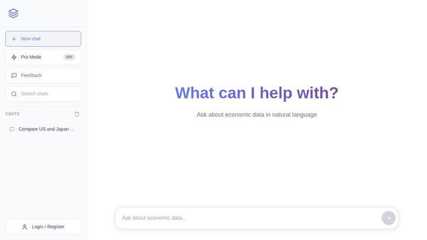

<p align="center">
  
</p>

<h1 align="center">OpenEcon Data</h1>

<p align="center">
  <strong>Query economic data from 10+ sources using plain English.</strong><br/>
  One natural-language interface for FRED, World Bank, IMF, Eurostat, Comtrade, and more.
</p>

<p align="center">
  <a href="https://data.openecon.io/chat"></a>
  <a href="LICENSE"></a>
  <a href="https://github.com/hanlulong/openecon-data/stargazers"></a>
  <a href="https://github.com/hanlulong/openecon-data/issues"></a>
  
  
</p>

<p align="center">
  <a href="https://openecon.ai">Website</a> &middot;
  <a href="https://data.openecon.io/chat">Live App</a> &middot;
  <a href="docs/README.md">Docs</a> &middot;
  <a href="docs/development/DEVELOPER_CONTRIBUTOR_GUIDE.md">Contributing</a>
</p>

---

<p align="center">
  
</p>

## Why OpenEcon Data?

Getting economic data today means juggling APIs, reading provider docs, wrangling country codes, and normalizing date formats. OpenEcon Data fixes this:

- **Ask in English** — "Compare US and Japan inflation since 2015" just works
- **One interface, 10+ sources** — FRED, World Bank, IMF, Eurostat, BIS, UN Comtrade, and more, all unified
- **MCP-native** — plug into Claude, Codex, or any MCP-compatible AI agent with one command
- **Self-hostable** — MIT-licensed, run locally or deploy your own instance
- **330,000+ indicators** — full-text search across the world's major economic databases

<p align="center">
  <b>330K+</b> indicators indexed &nbsp;&middot;&nbsp; <b>10+</b> data providers &nbsp;&middot;&nbsp; <b>200+</b> countries covered &nbsp;&middot;&nbsp; <b>< 5s</b> avg. query time
</p>

## Quick Start

### Use the hosted app (no setup)

Try it now at **[data.openecon.io/chat](https://data.openecon.io/chat)** — no account required.

### Add to your AI agent (one command)

**Claude Code:**
```bash
claude mcp add --transport sse openecon-data https://data.openecon.io/mcp --scope user
```

**Codex:**
```bash
codex mcp add openecon-data --url https://data.openecon.io/mcp
```

Then ask your agent:
```
Use query_data to compare US, UK, and Japan inflation from 2015 to 2025.
```

### Self-host

```bash
git clone https://github.com/hanlulong/openecon-data.git
cd openecon-data
cp .env.example .env          # Add your OPENROUTER_API_KEY
pip install -r requirements.txt
npm install
python3 scripts/restart_dev.py
# Backend: http://localhost:3001  |  Frontend: http://localhost:5173
```

<details>
<summary><b>Requirements</b></summary>

- Python 3.10+
- Node.js 18+
- An [OpenRouter API key](https://openrouter.ai/keys) (required for LLM parsing)
- Optional: FRED API key, Comtrade API key, Supabase credentials

See [Getting Started Guide](docs/guides/getting-started.md) for full setup instructions.
</details>

## Example Queries

| Query | Source | What you get |
|-------|--------|-------------|
| "US GDP growth for the last 10 years" | FRED | Time series chart with annual GDP growth % |
| "Compare China, India, and Brazil GDP growth 2018–2024" | World Bank | Multi-country bar chart comparison |
| "EUR/USD exchange rate history last 24 months" | ExchangeRate-API | Currency pair line chart |
| "US unemployment rate and CPI together since 2010" | FRED | Dual-axis chart, two series overlaid |
| "China exports to the United States 2020–2024" | UN Comtrade | Bilateral trade flow chart |
| "EU debt-to-GDP ratios across member states" | Eurostat | Cross-country comparison |
| "Credit to GDP ratio US, UK, Japan from BIS" | BIS | Central bank financial stability data |
| "Bitcoin price history for the last year" | CoinGecko | Crypto price chart |

## How It Works

```
  "US inflation and          ┌──────────────┐        ┌────────────┐
   unemployment rate"   ───▶ │  LLM Parser  │  ───▶  │   FRED     │
                             │  (OpenRouter) │        │   API      │
                             └──────┬───────┘        └─────┬──────┘
                                    │                      │
                             ┌──────▼───────┐        ┌─────▼──────┐
                             │ Query Router │        │ Normalizer │
                             │ (10+ provs.) │        │ (align,    │
                             └──────────────┘        │  format)   │
                                                     └─────┬──────┘
                                                           │
                                                     ┌─────▼──────┐
                                                     │ Chart +    │
                                                     │ CSV/JSON   │
                                                     └────────────┘
```

1. **Parse** — An LLM extracts intent, countries, indicators, and date range from your plain English query
2. **Route** — The system picks the best provider (FRED, World Bank, IMF...) based on the data requested
3. **Fetch** — Data is retrieved, normalized, and aligned across sources
4. **Visualize** — Results are returned as an interactive chart with CSV/JSON/DTA/Python export options

## Features

**Natural Language Interface** — Ask questions in plain English. An LLM parses your intent, picks the right provider, and fetches the data.

**Smart Indicator Discovery** — 330K+ indicators indexed with FTS5 full-text search. No need to know series codes — just describe what you want.

**Smart Joins** — Auto-match country/industry/classification codes and align frequencies across providers.

**Streaming Results** — Real-time progress via Server-Sent Events. See each step as it happens: parsing, routing, fetching, charting.

**MCP Server** — First-class [Model Context Protocol](https://modelcontextprotocol.io) support. Any MCP-compatible AI agent can query economic data through the hosted endpoint.

**Multi-Format Export** — Download results as CSV, JSON, DTA (Stata), or Python code. Every export includes source attribution and timestamps.

**Self-Hostable & Extensible** — MIT-licensed. Add new providers by implementing a single base class.

## Data Sources

| Provider | Coverage | Indicators | API Key |
|----------|----------|-----------|---------|
| **FRED** | US macroeconomic data | 90,000+ series | Free |
| **World Bank** | Global development | 16,000+ indicators | None |
| **IMF** | International financial statistics | Extensive | None |
| **Eurostat** | EU member states | Extensive | None |
| **UN Comtrade** | International trade flows | All HS codes | Free |
| **BIS** | Central bank & financial stability | Curated | None |
| **Statistics Canada** | Canadian economic data | 40,000+ tables | None |
| **OECD** | OECD member countries | Extensive | None |
| **ExchangeRate-API** | 160+ currencies | Live & historical | Free |
| **CoinGecko** | Cryptocurrencies | 10,000+ coins | Free |

## Architecture

```
┌─────────────────┐     ┌──────────────────┐     ┌──────────────────────────┐
│  User / Agent   │────▶│  FastAPI Backend  │────▶│  Data Providers          │
│                 │     │                  │     │                          │
│  "US inflation" │     │  LLM Parser      │     │  FRED · World Bank · IMF │
│                 │◀────│  Query Router    │◀────│  Eurostat · BIS · ...    │
│  Chart + Data   │     │  Normalizer      │     │                          │
└─────────────────┘     └──────────────────┘     └──────────────────────────┘
        │                        │
   React Frontend          MCP Endpoint
   (Vite + Recharts)     (SSE Transport)
```

**Stack:** Python · FastAPI · React · TypeScript · Vite · Recharts · FAISS · OpenRouter

## OpenEcon Ecosystem

| Project | Description |
|---------|-------------|
| **[OpenEcon Data](https://data.openecon.io/chat)** | Query economic data in plain English, chart results, export CSV/JSON *(this repo)* |
| **[Econ Writing Skill](https://github.com/hanlulong/econ-writing-skill)** | Reusable writing workflows for economists — prompt patterns, structure templates, analysis guardrails |
| **[Awesome AI for Economists](https://github.com/hanlulong/awesome-ai-for-economists)** | Curated tools, papers, and references for applying AI in economic research |

## Contributing

Contributions are welcome! See the [Developer & Contributor Guide](docs/development/DEVELOPER_CONTRIBUTOR_GUIDE.md) for setup instructions, architecture overview, and code standards.

- [Open issues](https://github.com/hanlulong/openecon-data/issues) — bug reports and feature requests
- [Documentation](docs/README.md) — full docs index
- [Security policy](.github/SECURITY.md) — responsible disclosure

If you find this useful, consider giving it a star — it helps others discover the project.

## License

[MIT](LICENSE)
